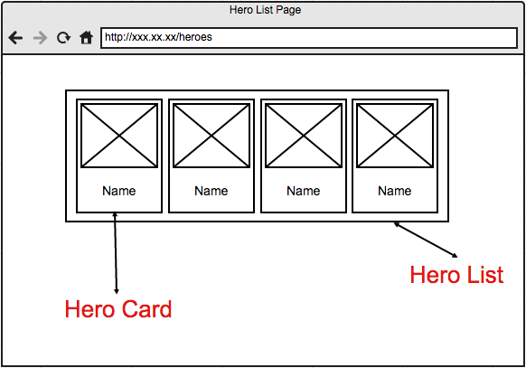
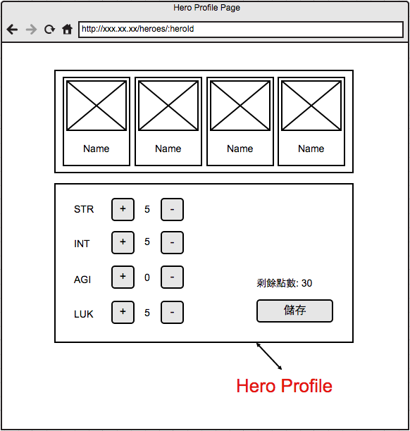

# Self-taught React

## UI Requirements
- Hero List Page
  - URL: `/heros`
  - Wireframe
  
  

  
  

- Hero Profile Page
  - URL: `/heros/:id`
  - Wireframe
  

  
  

## Devlopment Process
1. create UIs for the hero card list
2. create UIs for the hero's ability settings  
3. add state to hero's ability 
4. set up routes and pages
5. connect API endpoints to fetch data
